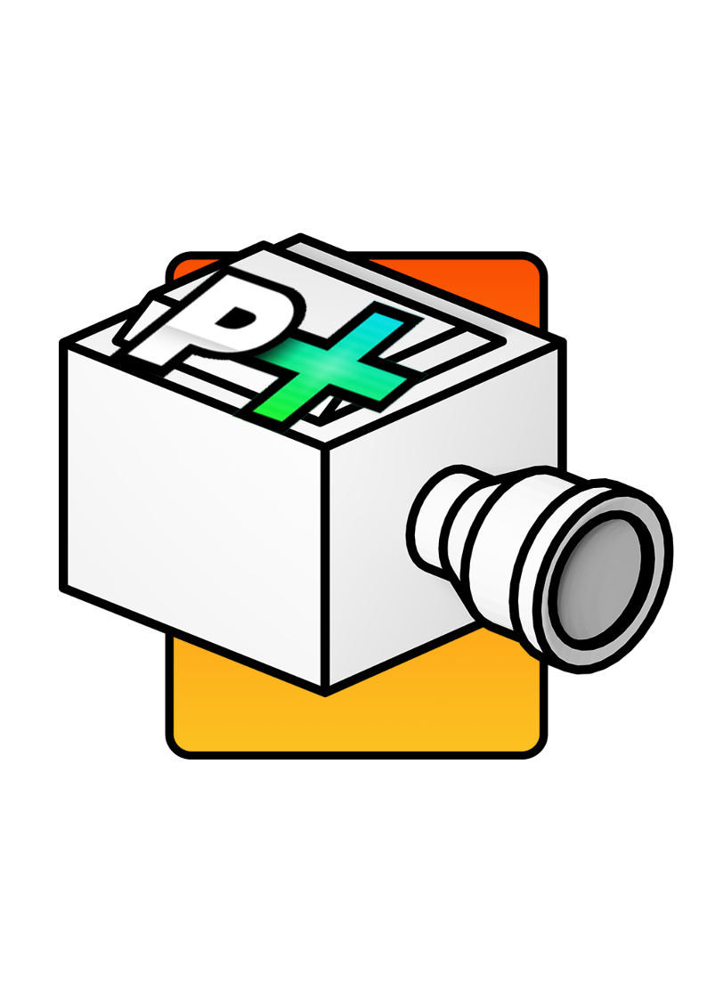
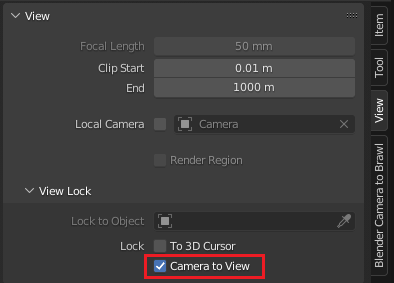

 

  
<h1 align="center">External Brawl Camera</h1>

## DESCRIPTION
External Brawl Camera is a port of External Melee Camera made by KELLZ

https://github.com/sadkellz/External-Melee-Camera
## INSTALLATION
Follow exactly the same steps as EMC, and install Add-on with my .py Files !
## IMPORTANT
>This Add-on is mean to be use on Project+ launcher.

**Project M 3.6 won't work** but it might be possible to **use it with 3.6R** !(not tested) 
## FEATURES
Since EBC is still in developement some features are missing from EMC and other are brand news !

**Ready :**
1. Control brawl Camera from Blender
2. Display position Player in scene
3. Display frame counter
4. new ! Z-Axis camera can be change
5. new ! Update Depth render camera
6. new ! Update blender camera position as brawl camera

Missing :

>Every feature wich involve direct connection between dolphin & blender
1. Save/Load dolphin State
2. Play & Pause dolphin emulator from blender
3. Screenshot, Image & Preview Sequence
> Any help for adding those features are welcome !

Could be added in near futur :
1.  Toggle On/Off Music or sound effect 
2.  Toggle On/Off Debug menu features
3.  Some zoom animation 
4.  FOV, Crop or transform (camera render)
5.  Automated Toggle Stage

## CONTACT & SUPPORT
You are free to ask me anything on discord at :
>Neyroe#4096

# DOCUMENTATION
## EXAMPLES
### EXAMPLE 1
https://github.com/Neyroe/External-Brawl-Camera/assets/62217068/2ca67b02-f303-4c83-93e9-77ab19153c30
### EXAMPLE 2
https://github.com/Neyroe/External-Brawl-Camera/assets/62217068/bc172d1e-82ef-4dfa-8ca8-bb6b58a111eb
### EXAMPLE 3
https://github.com/Neyroe/External-Brawl-Camera/assets/62217068/d870f56f-6e76-44fd-af16-8b881a06c692

## Optionnal
### Center blender camera
You can Add 3D View: 3D Navigation
 

  

## Known Issues
Z-Axis can only be updated in **pause** ?

You can change **camera position** while in **debug mod**, but the **rotation** while only be **updated on next frame**

You **cannot modify Z origin** position in game. This is where the camera is looking **(limited by brawl Engine)**

**Camera lock** has to be **Toggle ON** in debug menu (newly automated in last version of EBC)

# Acknowledgments
[External Melee Camera](https://github.com/sadkellz/External-Melee-Camera)
- For revolutionnasing the whole content creation scene !!  

Thanks to [KELLZ](https://github.com/sadkellz) 
- For his amazing work and help.

Thanks to [WhiteTpoison](https://github.com/JaredWhiteOne) 
- For helping on **EBC** & his work on **BrawlBack**.
